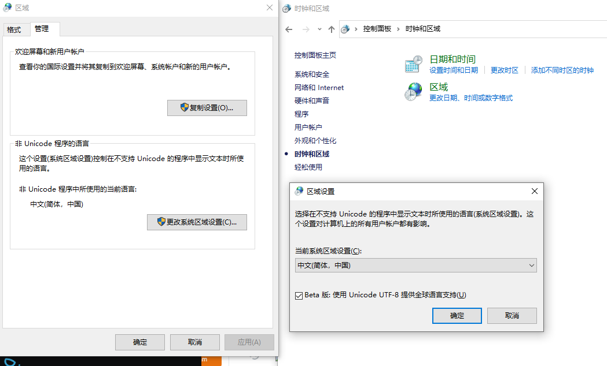

# 流程
## Chapter 1 windows 下的编译环境
1. 使用的是windows自己的编译环境，一个cl解决了所有的问题。
2. 点击start_vs_cmd.bat 进入cmd窗口，并且设置好了环境。
3. 进入项目根目录，如果是单独文件的项目，可以直接 cl filename.cpp就完成了
4. 如果是多个的 使用cl /c /TC mycode.c  编译c++文件与之前生成的c对象文件链接 c1 /EHsc main.cpp foo.c 编译得到，main.exe了。
5. 将codepage 设置成UTF-8
6. 用vcpkg安装tbb，直接使用vcpkg integrate install，并不能添加正常路径，需要将对应的路径分别添加INCLUDE,LIB,PATH.


## Chapter 2 语法增强部分
### 01 nullptr，NULL，zero的比较与函数调用匹配
使用编译指令：`cl /EHsc 01nullptr_zero.cpp` 运行01nullptr_zero.exe 获得输出内容，可以看到NULL的宏定义为int 0。
```
NULL == 0
call foo(int i)
call foo(int i)
call foo(char* ch))
```
增加调用foo(NULL)也可以，看来NULL只是被认为是宏了，值为0

### 02 constexpr 与 const
constexpr 是静态表达式，一些没有变动性的函数 可以使用，其中fibonacci的表达式就可以看到，连传入参数都是const的。
constexpr 可以在编译期展开。
```
constexpr int fibonacci( const int n ) {//函数标识为constexpr 传入参数也是const，
	return n==1 || n==2 ?1:fibonacci(n-1) + fibonacci(n-2);
}
```

### 03 type inference 类型推导，auto与decltype
auto，可以定义为任意type，由编译期来确定具体类型。auto 有多种类型，比如auto& ，const auto，const auto&，以及auto&&等。
注意点
1. auto函数参数设置为auto，编译不过，但是lambda的参数可以。
2. auto推导出来的是限制较多，可能与自己设定的有差距。
3. auto 作为迭代器的简化写法，要注意返回的类型，分为const iterator 就用const auto 和一般的iterator 就用auto

decltype，这个是从变量到类型转换的宏，这里为什么写成
`template<typename T, typename U>auto add(T x, T y)->decltype(x+y){ return x+y;}`

个人认为纯粹是因为前面摆不下了。c\++11之后就不用这么处理了，把后面的decltype(x+y)全部去掉就行了。
当然可以写成这样
`template<typename T, typename U>auto add(T x, T y){return x+y;}`
如果是lambda写法，这个部分可以编译通过。
` std::cout<<"C++14 version: "<<[](auto x,auto y){return x+y;}(36, 14)<<std::endl; `

### 04 for  或 for_each
这个语法类似c#中的foreach，包含了临时变量的定义等
`for(auto &x : container){}`
当然与之对应的也有
`std::for_each(begin,end,func);`
或者
`for(auto iter = begin();iter!=end(); iter++){} `

### 05 initializer_list 用{1,...,4} 初始化对象对象的写法
也就是参数构造函数内传递一个`initializer_list<int> list` 那么就可以用 `Magic m={1，2，3，5};`
这样的语句来创建一个结构体实例。
结构体初始化与继承相关，具体看具体代码吧
````
struct A{
	int a;
	float b;
};
struct B {
	B(int _a,float _b):a(_a),b(_b){};
private:
	int a;
	float b;
};

struct C:A{
	int c;
};
struct D:B{
	int d;
};

A insta{1,1.1};
B instb{2,2.2};
C instc{3,3.3f,3};
D instd{{4,4.4f},4};//因为B的private成员，并且自定义了带参数构造函数，因此，这里要套两个的格式不同
````


## Chapter 3 Enhance Template 增强模板
### 01 extern Template
编译多文件，按照顺序 写 cl /EHsc f1.cpp,...,main.cpp 就可以了 更方便一点。
默认的模板在使用时才实例化，在编译过程中可能会出现多次实例化过程，这个时候建议使用`extern template class MyTemplate<int>;` 提前实例化，减少重复的次数。
**这个算是优化编译过程了。**
类似的情况，还有class 内部inline 全局变量。
之前为了防止引用出错，需要在cpp文件内定义，在h文件内声明，现在加上inline的方式就可以了。
比如：
```
template <typename T>
class MyTemplate {
public:
	inline static std::string msg{"OK"};
    ...
};
inline static My_Structure mstruct;
```

### 02 多层嵌套的模板容器的定义。
比如这个
```
template<bool T>struct SuckType{};//定义了一个模板struct 
//实例化一个容器vector，
//里面包含的bool值都是false。 这个例子是显示右向>被正常的解析了。
vector<SuckType<(1>2)>> v;
```
比如namespace的嵌套 也可以简单的写成
`namespace A::B::C::D{}`

### 03 using的用法，重命名和函数指针命名
这两种方法都是为了替代typedef，当然using写法要清晰多了。
对比以下两个的写法
```
typedef int (* processfn ) (int,int );//*就可以定义指针类型了，塞进去的processfn就是类型名。
using processFN = int(*)(int, int);//processFN也是特别函数指针的名字。
```
当然也可以简写名字 比如
```
using print=std::cout
```
### 04 指定了默认类型的模板函数定义
基本的玩法类似，指定了默认参数的函数。
```
template<typename T=int, typename U=int>//默认指向了int，但是一旦要填，就要填完，不如默认函数参数那样方便。
auto add( T x, U y){
	return x + y;
}
add( 10, 11);
add<int,float>( 10, 11.5f);
add<float,float>( 10.2f, 11.05f);
```
### 05 变类型数量的模板
**非常独特的玩法，我至今没有完全掌握，只能模仿使用** 请多看几次吧
典型的应用argv的形式，对应的printf的输入参数等。
1、对应C语言方法，当然，传入参数要是引用类型还是要特别标注的。当然不推荐在现代c++代码中使用（请一定去掉）
``` 

#include <cstdarg>
#include <iostream>

void PrintNumbers(int count, ...) {
    va_list args;
    va_start(args, count);
    for (int i = 0; i < count; ++i) {
        int value = va_arg(args, int);
        std::cout << value << ' ';
    }
    va_end(args);
    std::cout << '\n';
}
// 使用方式：PrintNumbers(3, 10, 20, 30);

```
2、 使用initializer_list，初始化列表展开。initialize_list的用法，之前用过，也就是都支持{...}的初始化过程，这里是说，配合模板参数作为参数的写法。 这个用法跟initializer_list的实现有关，理解起来比较麻烦。
```
template<typename T, typename... Args>
auto print2(T value, Args... args){
	cout<<value<<' ';
	return initializer_list<T>{([&]{
		cout<<args<<' ';
	}(),value)...	};
}
```
3、使用模板和参数包（推荐的方式） 可以照着写。这种情况，比较符合所有类似list的展开方式。
```
#include <iostream>

// 基础情况：仅有一个参数时的处理
void Print() {
    std::cout << '\n';//为了与第一个的实现相同，最后自带一个换行。
}

// 可变参数模板函数
template<typename T, typename... Args>
void Print(const T& firstArg, const Args&... args) {
    std::cout << firstArg << ' ';
    Print(args...); // 递归展开参数包
}

// 使用方式：Print(10, 20, 30, "Hello", 3.14);
```

## Chapter 4 增强面向对象相关的内容
### 01 部分构造函数，构造函数之间调用，以及default函数定义，以及属性的initialized value表达
需要明白的是，预设的初始值的方式为 `int value1{0};` 
default的用法是`Base()=default;//default标识属性非初始化，为任意值。等同于空` 注意代码注释。
多个构造函数直接可以调用，但请注意，**构造函数调用的还是构造函数**
注意下面的情况：
```
class Cell{
public:
	int x{0};
	int y{0};
	Cell() = default;
	Cell(int value):Cell(){ //部分构造函数，并且调用了其他构造函数
		y = value;
	}
};
```
### 02 全盘接收基类的定义，using Base::Base的写法。
当然，也可以注意使用
```
class Base{
public:
	int value1;
	int value2;
    int GetValue3(){
		return value3;
	}
	void SetValue3(int v){
		value3 = v;
	}
private:
	int value3{0};
};
class Subclass:public Base {
	public:
		using Base::Base;//inherite constructor,
		//其实是把Base的部分都放public下面了？反正下面用s.GetValue3()是可以的。不能越过Base的权限，s.value3是不行的。
};
```

### 03 override，final的用法，相对c# 还是简单了一点，少了new等用法。
final：最终的，之后不能再override了。
override：覆盖的，不到final 不会禁止override
大体上理解这个含义即可。

### 04 显式删除默认函数
传统cpp中默认提供的函数有，默认构造函数，复制构造，赋值运算符以及析构函数还有移动构造函数 移动赋值操作符 ，可以重构或者禁用他们。
同样定义了诸如 new，delete这样的运算符，运算符可以重载这些函数
c++11 之后，允许我们显式的声明采用或拒绝编译器自带的函数。 默认采用用default，拒绝用delete

**350原则** 非常重要，为了能够与其他的模板函数进行配套，必须要执行的原则。
1. {析构函数，拷贝构造函数，拷贝赋值操作符} 三对齐
2. {析构函数，拷贝构造函数，拷贝赋值操作符，移动构造函数，移动赋值操作符 } 五对齐
3. 0的含义是，五对齐中一个都不实现，方便c++的资源管理类，比如智能指针。

另外这里还解释了new delete的用法 包括placement new的用法等，自己加的，值得多看几次。
如果要用placement new，那最好结合shared_ptr，隐蔽new和delete的操作，否则会出问题。
```
#include <iostream>
#include <cstdlib> 
#include <new>
using namespace std;
//传统cpp中默认提供的函数有，默认构造函数，复制构造，赋值运算符以及析构函数还有移动构造函数 移动赋值操作符 ，可以重构或者禁用他们。
//同样定义了诸如 new，delete这样的运算符，运算符可以重载这些函数
//c++11 之后，允许我们显式的声明采用或拒绝编译器自带的函数。 默认采用用default，拒绝用delete

//这里有个350原则。也就是{析构函数，拷贝构造函数，拷贝赋值操作符} 三对齐
//{析构函数，拷贝构造函数，拷贝赋值操作符，移动构造函数，移动赋值操作符 } 五对齐
//0的含义是，五对齐中一个都不实现，方便c++的资源管理类，比如智能指针。
class Magic{
public:
	Magic(){};//默认构造函数
	Magic& operator=( const Magic&)=delete;//赋值运算符
	Magic(int v){
		value2 = v;
	}
	//使用默认的拷贝构造函数
	Magic(const Magic&)=default;
	~Magic() = default;
	// 重载 new 运算符 
    void* operator new(size_t size) 
    {     
        std::cout << "Custom new for size " << size << std::endl; 
        void* storage = std::malloc(size); 
        if (nullptr == storage) { throw std::bad_alloc(); } 
        return storage; 
    } 
    // 重载 delete 运算符 
    void operator delete(void* p) { 
        std::cout << "Custom delete" << std::endl; 
        std::free(p); 
    } 
    // 如果需要，还可以重载 new[] 和 delete[] 
    void* operator new[](size_t size) { 
        // 类似于 operator new，但用于数组 
        std::cout << "Custom new[] for size " << size << std::endl; 
        void* storage = std::malloc(size); 
        if (nullptr == storage) { throw std::bad_alloc(); } 
        return storage; 
    } 
    void operator delete[](void* p) { 
        // 类似于 operator delete，但用于数组 
        std::cout << "Custom delete[] " << std::endl; 
        std::free(p); 
    } 
    
    // Placement new操作符重载
    void* operator new(std::size_t size, void* ptr) noexcept {
        return ptr;
    }
    
	int value1{0};
	int value2;
};
int main(){
	Magic* p = new Magic(20);
	cout<<"Magic : "<<p->value1<<" , " <<p->value2<<endl;
	delete p;
	Magic* parray = new Magic[10];//注意默认构造函数不能拒绝。
	for(int i=0; i<10; i++)
		cout<<"Magic : "<<parray[i].value1<<" , " <<parray[i].value2<<endl;
	delete[] parray;
	
	char buffer[sizeof(Magic)*3];
	Magic* arrayPtr = reinterpret_cast<Magic*>(buffer);
	for(int i=0;i<3;i++) new (arrayPtr+i) Magic(i);// 使用placement new
	for(int i=0;i<3;i++) arrayPtr[i].~Magic();
}
```
## Chapter 5 Enum Class的用法
### 01 static_cast的常规用法，基本类似于旧的用法。

## Chaper 6 Lambda 
### 01 简单的Lambda，定义并指向变量（RAII原则），难度在于捕获和Scope的概念。
其中捕获和scope的区分为：
- []空捕获列表。
- [name1,name2,...] 捕获一系列变量。
- [&]引用捕获，让编译器自行推导捕获列表。
- [=]值捕获，让编译器执行推导应用列表。

另外，c++14允许捕获的成员用任意的表达式进行初始化，比如下面这个语句
```
auto important = std::make_unique<int>(1);
auto add = [v1 = 1, v2 = std::move(important)](int x, int y)
-> int {
return x+y+v1+(*v2);
};

```
### 02 c++17扩展的部分
1. 带泛型的Lambda 比如：
```
auto genericLambda =[](auto x, auto y){return x+y;};
```
2. 捕捉了*this，可以在lambda中方便访问内部成员变量。（当然std::bind，但是bind只能是实际对象）
```
class C{
private:
	std::string name;
public:
	void foo(){
		auto l1=[this]{std::cout<<name<<'\n';};
		auto l2=[=]{std::cout<<name<<'\n';};
		auto l3=[&]{std::cout<<name<<'\n';};
		l1();
		l2();
		l3();
	}
};
```
3. 声明contexpr的lambda，可以在编译期确定。（可以用来在类型定义时当宏一样使用。）
```
auto hashed = [](const char* str) constexpr {
	std::size_t hash = 5381;//初始化哈希值
	while(*str != '\0'){
		hash = hash*33^*str++;
	}
	return hash;
};
enum Hashed {//只验证能否在编译期确定，要遍历起来还是很麻烦啊。
	beer = hashed("beer"),
	wine = hashed("wine"),
	water = hashed("water"),
};
```
4. 捕捉移动构造的对象 也就是用[&&]的情况
5. 以长规格和属性，添加noexcept的情况，类似c#的返回int?的情况。
```
auto divide = [](auto x, auto y) noexcept->decltype(x) {
	if( y == 0 ) return std::numeric_limits<decltype(x)>::quiet_NaN();
	return x/y;
};
```
6. 嵌套lambda中，捕捉范围的重新定义（只能缩小范围，不能放大）
```
auto outerLambda = [x]()mutable{
	return [&,x]{std::cout<<x<<std::endl;};//“x”: 无法在非可变 lambda 中修改通过复制捕获,其实没啥用啊
};
auto innerLambda = outerLambda(); // 调用外部lambda获取内部lambda。
innerLambda(); // 调用内部lambda，增加外部lambda捕获的x的副本
```
7. 指定返回类型（在[]()->?{};?处要替换的内容）
```
auto complexReturnLambda = [](int x) -> std::pair<int, int> {
      if (x > 0)
        return {x, x};
      else
        return {-x, -x};
};
```

### 03 扩展学习Lambda与STL的算法部分的代码
#### 01 for_each 和 for_each_n  
范围内，执行相同operation。其中 for_each_n 替换成for_each的写法如下：
```
template<typename Iterator, typename Size, typename Function>
void safe_for_each_n(Iterator begin, Iterator end, Size n, Function f) {
    // 计算剩余距离，防止越界
    const Size distance = std::distance(begin, end);
    // 如果距离小于n，则调整n为实际的距离
    Size safe_n = std::min(n, distance);
    // 获取安全的结束迭代器位置
    Iterator safe_end = std::next(begin, safe_n);
    // 使用for_each遍历从begin到safe_end的范围
    std::for_each(begin, safe_end, f);
}
```
#### 02 all，any，none 集合运算的概念
假设判断为c，则all_of(range,c) == !any_of(range, !c) = none_of(range, !c)
执行情况，any 一经发现就可以停止，一般用any替换会更好一点。
经典的写法
```
struct DivisibleBy//经典用法 struct 下面的bool operator()(int n){}的用法。
{
    const int d;
    DivisibleBy(int n) : d(n) {}
    bool operator()(int n) const { return n % d == 0; }
};
 
if (std::any_of(v.cbegin(), v.cend(), DivisibleBy(7)))
    std::cout << "At least one number is divisible by 7\n";
```

#### 03 find，find_end,find_first_of,adjacent_find,寻找收购满足特定判定标准的元素。
其中 find，find_if, find_if_not,最终结果都是返回迭代器位置。其中 `find(begin,end,n )`等同于 
`find_if(begin, end, [](const auto& v){return v==n;})`，可以知道 find只是find_if的简写，find_if 可以替代find_if_not.
其中 find_end的使用方式是`std::find_end(target.begin(),target.end(),s.begin(),s.end())` 与find不同的是，判断值可以用一个区段来表示。
```
#include <algorithm>
#include <array>
#include <cmath>
#include <iostream>
 
auto print_result = [](auto result, const auto& v)
{
    result == v.end()
        ? std::cout << "未找到序列\n"
        : std::cout<<*result << " 最后一次在位置 " << std::distance(v.begin(), result)
                    << " 出现\n";
};
 
int main()
{
    const auto v = {1, 2, 3, 4, 1, 2, 3, 4, 1, 2, 3, 4};
 
    for (auto const& x : {std::array{1, 2, 3}, {4, 5, 6}})
    {
        auto iter = std::find_end(v.begin(), v.end(), x.begin(), x.end()); // 重载 (1)
        print_result(iter, v);
    }
 
    for (auto const& x : {std::array{-1, -2, -3}, {-4, -5, -6}})
    {
        auto iter = std::find_end(v.begin(), v.end(), x.begin(), x.end(), // 重载 (3)
                                  [](int x, int y)
                                  {
                                      return std::abs(x) == std::abs(y);
                                  });
        print_result(iter, v);
    }
}
```
其中 find_first_of,与find_end不同，这里表示**在范围 [first, last) 中搜索范围 [s_first, s_last) 中的任何元素。**
可以看这个输出结果，既可以明白
```
在位置 2 找到匹配 (3)
t = { 19, 10, 3, 4 }
v = { 0, 2, [ 3 ], 25, 5 }
```
其中 adjacent_find:在范围 [first, last) 中搜索两个连续的相等元素。
#### 04 count:确定有多少匹配目标值 count_if：确定有多少满足条件值。
这里有个简单写的计算两个iterator的距离，满足O(N)复杂度的。
```
// 简化版的 distance，具有 O(N) 复杂度：
auto distance = [](auto first, auto last)
{
    return std::count_if(first, last, [](auto){ return true; });
};
```

#### 05 mismatch，匹配，equal 相等：
mismatch 返回来自两个范围的首个不匹配元素对偶，不匹配返回边界迭代器。 带判断条件的写法如下（其一）。
```
template<class InputIt1, class InputIt2, class BinaryPredicate>
std::pair<InputIt1, InputIt2>
    mismatch(InputIt1 first1, InputIt1 last1, InputIt2 first2, BinaryPredicate p)
{
    while (first1 != last1 && p(*first1, *first2))
        ++first1, ++first2;
 
    return std::make_pair(first1, first2);
}
```
equal 返回来自两个范围是否相等的情况，相等为true，不等为false。
```
template<class InputIt1, class InputIt2, class BinaryPredicate>
constexpr //< C++20 起
bool equal(InputIt1 first1, InputIt1 last1,
           InputIt2 first2, BinaryPredicate p)
{
    for (; first1 != last1; ++first1, ++first2)
        if (!p(*first1, *first2))
            return false;
 
    return true;
}
```
#### 06 search，search_n 
带_n的都可以退回到去掉_n 的情况，这里只介绍search。搜索范围 [first, last) 中首次出现元素序列 [s_first, s_last) 的位置。
```
template<class ForwardIt1, class ForwardIt2, class BinaryPredicate>
constexpr ForwardIt1 search(ForwardIt1 first, ForwardIt1 last,
                            ForwardIt2 s_first, ForwardIt2 s_last,
                            BinaryPredicate p)
{
    while (true)
    {
        ForwardIt1 it = first;
        for (ForwardIt2 s_it = s_first; ; ++it, ++s_it)
        {
            if (s_it == s_last)
                return first;
            if (it == last)
                return last;
            if (!p(*it, *s_it))
                break;
        }
        ++first;
    }
}
```
#### 07 copy,copy_if,copy_n，copy_backward 复制范围 [first, last) 中的元素到从 d_first 开始的另一范围（复制目标范围）。
其中一个的实现方式为，如果d_first 与[first,last)无关的话，结果将放在新的位置上也就是复制的作用，否则就是赋值的作用。
```
template<class InputIt, class OutputIt, class UnaryPredicate>
OutputIt copy_if(InputIt first, InputIt last,
                 OutputIt d_first, UnaryPredicate pred)
{
    for (; first != last; ++first)
        if (pred(*first))
        {
            *d_first = *first;
            ++d_first;
        }
 
    return d_first;
}

```

#### 08 move,move_backward，参考copy，这里表示移动。
与copy 进行比较可以看到这里底层调用的是std::move()而copy调用的是operator=
移动重叠的范围时，std::move 在向左侧移动（目标范围的起始在源范围外）时适合，而 std::move_backward 在向右侧移动（目标范围的结尾在源范围外）时适合。
```
template<class InputIt, class OutputIt>
OutputIt move(InputIt first, InputIt last, OutputIt d_first)
{
    for (; first != last; ++d_first, ++first)
        *d_first = std::move(*first);
 
    return d_first;
}
```
#### 09 swap，swap_ranges 
#### 10 transform
#### 11 replace,replace_if,replace_copy,replace_copy_if
#### 12 fill, fill_n
#### 13 generate,generate_n, itoa
#### 14 remove,remove_if,remove_copy,remove_copy_if
#### 15 unique, unique_copy
#### 16 reverse,reverse_copy
#### 17 rotate,rotate_copy
#### 18 random_shuffle
#### 19 sample
#### 20 is_partitioned,partition,partition_copy,stable_partition,partition_point
#### 21 sort,stable_sort
#### 22 partial_sort, partial_sort_copy
#### 23 is_sorted,is_sorted_until,nth_element


## Chapter 7 Function
### 01 函数指针的用法
1 使用using指定一个函数指针类型，当然用typedef也行
```
using foo = void(int); // 定义函数指针, using 的使用见上一节中的别名语法
```
2  使用stl的functional中的std::function 
using的方式比较简单，就用function实现了一个广播类型。值得多看看。

```
int foo(int para) {
	return para;
}
// std::function 包装了一个返回值为 int, 参数为 int 的函数
std::function<int(int)> func = foo;

int important = 10;
std::function<int(int)> func2 = [&](int value) -> int {
	return 1+value+important;
};
```

### 02 函数参数绑定 stl bind与placeholder的用法
bind 比较惊艳的方式是这个，将成员函数跟它的对象都绑一起，然后生成了一个函数指针。
`auto boundFunc = std::bind(&MyClass::memberFunction, &myObject, 42);`
placeholde的用法，相对比较简单，表述传入参数，可以用来自己做匹配或者减少输入参数的数量。
用例也是广播类型，可以比较看看。或者以下的例子：
```
int foo(int a, int b, int c) {
;
}
// 将参数1,2绑定到函数 foo 上，但是使用 std::placeholders::_1 来
对第一个参数进行占位
auto bindFoo = std::bind(foo, std::placeholders::_1, 1,2);
// 这时调用 bindFoo 时，只需要提供第一个参数即可
bindFoo(1);
```


## Chapter 8 右值 左值
| 函数形参类型 | 实参参数类型 | 推到后函数形参类型 |
|:----------:|:----------:|:---------------:|
| T&| 左引用 |T& |
| T&| 右引用 | T&|
|T&&| 左引用 | T&|
|T&&| 右引用 | T&&|


## Chapter 9 STL 扩展
### 01 array 数组的优缺点和用法
array能够让代码变得更加现代，且封装了一些操作函数，同时还能够友好的使用标准库的容器算法等。
常用的初始化的过程，基本上所有的容器的初始化过程含义都相同。
1. std::array<int, 3> a1{{1, 2, 3}}; // CWG 1270 修订前的 C++11 中要求双花括号
2. std::array<int, 3> a2 = {1, 2, 3};//按声明初始化，少则补default
3. std::array<std::string, 2> a3{"E", "\u018E"};//string 支持utf
4. std::array a4{3.0, 1.0, 4.0};//数组创建的推导指引 (C++17 起)
5. std::array<int, 2> a5; // 无列表初始化，a5[0] 和 a5[1] 均被默认初始化,默认不初始化。不做内存清理。
6. std::array<int, 2> a6{}; // 列表初始化，两个运算均被值初始化，部分初始化，即全部初始化。
7. std::array<int, 4> a7{1}; // 列表初始化，未指定的元素被值初始化，部分初始化，即全部初始化。 a7[0] = 1, a7[1] = 0


### 02 forward_list 单向列表的优缺点和用法
forward list 单link的链表，没有办法获得size，单link容易出现环，因为不直接操作指针，所以用forward list就不会出现环解构了。
std::forward_list 是支持从容器中的任何位置快速插入和移除元素的容器。不支持快速随机访问。它实现为单链表，且实质上与其在 C 中的实现相比无任何开销。与 std::list 相比，此容器在不需要双向迭代时提供更好的存储空间效率。
front 访问第一个元素
```
std::forward_list<int> flist = {1,2,3,4,5,6,7};
auto size = std::distance(flist.begin(),flist.end());
```
常用操作：`push_front，pop_front，assign，clear`

### 03 unordered contrainer 乱序容器的优缺点
不需要特别排序，减少了一个排序的成本。

### 04 tuple 元组的构建与解构
### 05 Shared_ptr 共享指针的用法 引用计数的指针 与左值右值
### 06 Unique_ptr 唯一指针的用法 
### 07 Weak_ptr 弱共享指针的用法 不增加引用计数的指针，重要作用。

## Chapter 10 正则表达式Regex
### 01 文件系统的过滤方案

## Chapter 11 Thread
异步编程的各种方案比较

## Chapter 12 Miscellaneous
C\++的杂项，一些可能是新版本的c\++才有的写法与用法
## Chapter 13 SDL-3 
要学习SDL-3，改动很多，还支持底层的rendering driver想过的内容，对SDL2 有扩展

## Chapter14 C语言名题精选百例转C++23版本
### 为什么要学这个

## 具体数学-CPP版本
学习《具体数学》，然后写完示例，总结一下

学习一些奇妙的技巧，重要的是要对比测试是否有c++高级版本有替代方案，于是就有相同名字，然后不同后缀的编码形式，而且有自己的测试流程最终比较性能